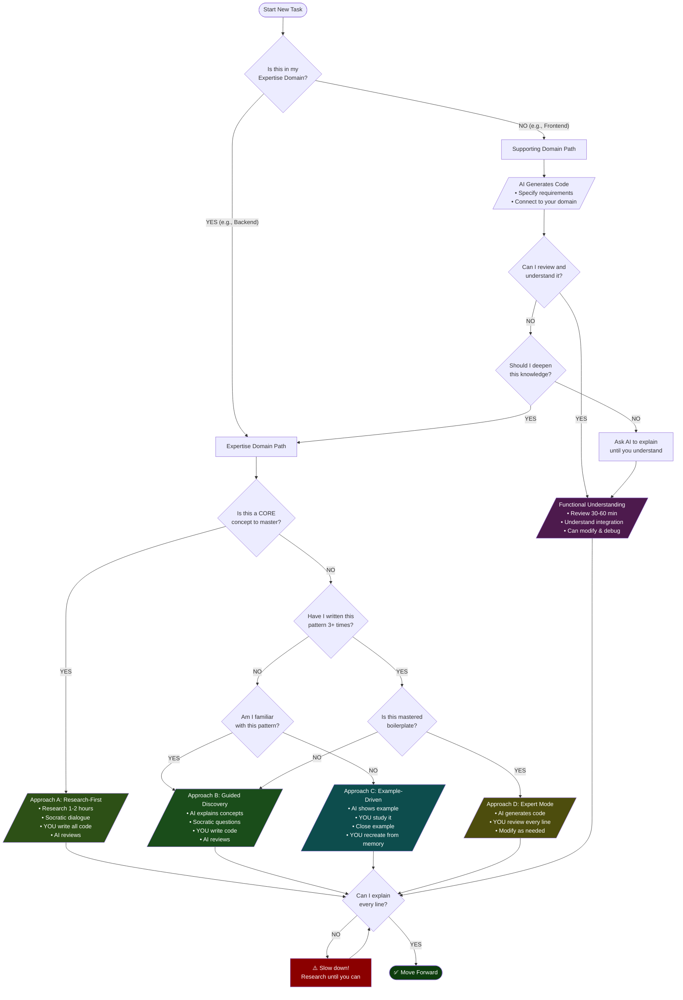

> A framework for deciding when and how to use AI based on your skill level and objectives.

---

## Core Principles

### 1. AI as Learning Accelerator
**Use AI as a force multiplier for learning, not a replacement for thinking.**

### 2. The Socratic Method
**Learn through cooperative dialogue where both parties ask questions.**

The Socratic Method is a teaching technique where instructor and student engage in **bidirectional questioning** - both can pose open-ended questions to explore a topic deeply, rather than one-way lecturing.

#### **How It Works with AI**

In traditional Socratic teaching:
- **Teacher** asks probing questions → **Student** answers and asks their own questions → **Both explore together**

With AI in Socratic dialogue:
- **AI** asks questions about your thinking → **You** answer and ask questions back → **Cooperative discovery**

**The key**: Learning happens through **dialogue and questioning from both sides**, not passive information transfer.

#### **Bidirectional Socratic Dialogue with AI**

The most powerful approach combines both directions:

**AI Questions Your Thinking (Socratic Probing)**

Ask AI to probe your approach with questions to expose gaps and challenge assumptions.

**How to activate it**:
```
You: "I want to implement [feature]. Before you tell me how, ask me 
     Socratic questions to help me think through the approach myself."

AI: "What problem are you trying to solve?"
You: "I need to authenticate users"
AI: "What approaches have you considered?"
You: "JWT tokens, maybe OAuth?"
AI: "Why JWT over session-based auth?"
You: "Hmm, I'm not sure of the trade-offs..."
AI: "Let's explore that. What do you know about stateless vs stateful auth?"
You: [Answers, then asks] "Wait, why would stateless be better for my use case?"
AI: "Good question! What are your scaling requirements?"
```

**Notice**: This is **bidirectional** - you answer AI's questions AND ask your own questions back.

**What AI should question**:
- ✅ Your proposed approach and alternatives considered
- ✅ Your assumptions and edge cases
- ✅ Your understanding of underlying concepts
- ✅ Your design decisions and trade-offs
- ✅ Gaps in your mental model

**Example prompts to start Socratic dialogue**:
```
"I think I should use [approach]. Ask me questions to challenge my thinking, 
and I'll ask questions back as we explore this together."

"I just read about [concept]. Let's have a Socratic dialogue where you quiz 
me and I can ask clarifying questions."

"I implemented [feature]. Question my decisions and help me find edge cases 
through dialogue."

"I'm stuck on [problem]. Let's explore this through questions - you ask me 
about my thinking, I'll ask about concepts I don't understand."
```

---

**You Question AI's Suggestions (Critical Analysis)**

When AI suggests an approach, engage in dialogue by questioning it:

**Example Socratic exchange**:
```
AI: "I suggest using JWT with refresh tokens"
You: "Why JWT over sessions?"
AI: "JWT is stateless, which helps with scaling"
You: "What are the downsides of stateless auth?"
AI: "You can't revoke tokens easily. How important is instant revocation for you?"
You: "Very important. What if we combined approaches?"
AI: "Interesting! What hybrid approach are you thinking?"
You: "What if we use JWT but track them in Redis?"
AI: "That could work. What problem does that solve vs pure sessions?"
```

**Key questions to ask AI**:
- "Why is this approach better than [alternative]?"
- "What assumptions are we making here?"
- "What would happen if we removed [component]?"
- "What are the edge cases this doesn't handle?"
- "How would you explain this to someone who doesn't know [prerequisite]?"
- "What are the trade-offs I should consider?"

---

**The Socratic Dialogue Pattern**

The most effective learning combines both directions in continuous dialogue:

```
1. You propose an approach or AI suggests one
2. AI asks probing questions about your thinking
3. You answer and ask clarifying questions back
4. AI responds and poses deeper questions
5. You challenge assumptions (yours or AI's)
6. AI helps you explore alternatives
7. You ask "why" repeatedly until reaching first principles
8. Continue dialogue until deep understanding emerges
```

**Benefits of Bidirectional Socratic Dialogue**:
- 🎯 Exposes gaps you didn't know existed
- 🎯 Forces you to articulate your reasoning
- 🎯 Builds critical thinking skills
- 🎯 Reveals faulty assumptions early
- 🎯 Deepens understanding through active discovery
- 🎯 Prevents passive acceptance of solutions
- 🎯 Explores the solution space thoroughly

### 3. Rubber Duck Debugging
**Explain your code out loud to understand it deeply.**

Rubber Duck Debugging is a method where you explain your code line-by-line to an inanimate object (traditionally a rubber duck). With AI, this becomes even more powerful:

**Traditional Rubber Ducking**:
- Explain code to yourself or an object
- Often reveals bugs and logic errors
- Forces you to articulate your thinking

**AI-Enhanced Rubber Ducking**:
- Explain AI-generated code back to the AI
- AI can correct misunderstandings immediately
- Creates a feedback loop for learning

**How to Use It**:
```
1. AI generates code
2. You explain it back line-by-line:
   "This line does X because..."
   "This function is needed for..."
   "The flow works like..."
3. AI validates or corrects your understanding
4. You refine your mental model
5. Repeat until explanation is perfect
```

**Benefits**:
- ✅ Exposes gaps in understanding immediately
- ✅ Builds mental models of how code works
- ✅ Catches logic errors and edge cases
- ✅ Reinforces learning through articulation

---

### 4. Code Ownership & Write Your Own Code
**Code is a social contract - you must write and own it yourself, not generate it blindly.**

> Code isn't human readable machine instructions - It's machine readable human instructions. In a very real sense of the word, it's the prompt. It's the social contract of the product. As an engineer your job is to be an expert in that social contract and manipulate it at need. People who think engineer's job is to produce code are totally ignorant.

#### **Why Code Ownership Matters**

Code is not just instructions for a computer - it's:
- 📜 **A social contract** between you, your team, and future maintainers
- 💭 **Documentation of intent** - what the product should do and why
- 🎯 **Your responsibility** - you must be able to explain, defend, and modify it
- 🧠 **A mental model** - understanding the codebase is understanding the product

**If you didn't write the code yourself, you don't truly own it.**

#### **The Core Rule: Avoid AI Code Generation While Learning**

**As a beginner/learner: WRITE YOUR OWN CODE. Don't ask AI to generate it.**

**Why you should avoid AI code generation**:
- ❌ **Generated code isn't yours** - you didn't think through the problem
- ❌ **You skip the struggle** - struggle is where deep learning happens
- ❌ **You miss the patterns** - typing code yourself reveals patterns
- ❌ **No muscle memory** - you don't build syntax fluency
- ❌ **False confidence** - you think you understand but can't recreate it
- ❌ **Dependency forms** - you become unable to code without AI

**Instead, use AI for**:
- ✅ **Explaining concepts** - "How does Spring Security work?"
- ✅ **Reviewing your code** - "I wrote this, what can be improved?"
- ✅ **Debugging help** - "Why is this throwing an error?"
- ✅ **Socratic questioning** - "Ask me questions about my approach"
- ✅ **Architecture guidance** - "What's the best way to structure this?"

**Then YOU write the code yourself.**

#### **When You CAN Use AI Code Generation**

Only use AI to generate code when **ALL** of these are true:

**Expertise Check**:
- ✅ You know **exactly** what you're going to write before asking
- ✅ The syntax is **fluent** to you (you could write it yourself)
- ✅ You've written this pattern **3+ times** by hand already
- ✅ You can **explain every line** without looking at documentation
- ✅ You understand all **trade-offs and alternatives**

**Use Cases for AI Generation (When Expert)**:
- ✅ **Boilerplate you understand** - Entity classes, DTOs, configs you've written many times
- ✅ **Repetitive patterns** - CRUD operations you've mastered
- ✅ **Speed up known work** - Implementing patterns you're fluent in
- ✅ **Scaffolding** - Project structure you understand completely

**Critical**: Even when using AI generation as an expert, you must:
1. Review every line
2. Understand why it's written that way
3. Be able to modify it confidently
4. Take full ownership of it

#### **The Learning Progression**

**Stage 1: Beginner (Learning Mode)**
```
❌ DON'T: "AI, implement authentication for me"
✅ DO: "AI, explain how authentication works"
       [Research independently]
       "AI, ask me questions about my approach"
       [YOU write the code]
       "AI, review my code and suggest improvements"
```

**Stage 2: Intermediate (Building Fluency)**
```
❌ DON'T: Generate entire features
✅ DO: "AI, show me an example of [pattern]"
       [Study the example]
       [Close the example]
       [YOU write your own version from memory]
       [Compare and learn from differences]
```

**Stage 3: Advanced (Selective Generation)**
```
✅ CAN: Generate boilerplate you've mastered
✅ CAN: Speed up repetitive patterns you're fluent in
✅ MUST: Still review, understand, and own everything
```

#### **Code Ownership Checklist**

Before moving on from ANY code (yours or AI's), verify:

**Understanding**:
- [ ] Can I explain what this code does line-by-line?
- [ ] Can I explain WHY it's written this way?
- [ ] Do I understand the design patterns used?
- [ ] Can I identify what would break if I changed X?

**Ownership**:
- [ ] Did I write this myself, or do I understand it as if I did?
- [ ] Could I defend this code in a code review?
- [ ] Could I explain this to a teammate?
- [ ] Could I modify this for a different use case?
- [ ] Would I be comfortable maintaining this in production?

**Fluency**:
- [ ] Could I write similar code without any help?
- [ ] Do I understand the alternatives and trade-offs?
- [ ] Can I spot bugs or improvements in this code?
- [ ] Do I know what to Google if something breaks?

**If you answered "no" to ANY of these, you don't own the code yet.**

#### **Working with Teams: The Social Contract**

When working with other people, code ownership becomes even more critical:

**Your responsibilities**:
- 🤝 **Understand the existing codebase** - it's the team's social contract
- 🤝 **Write code others can understand** - you're adding to that contract
- 🤝 **Explain your changes** - defend your additions to the contract
- 🤝 **Maintain consistency** - respect the existing patterns and conventions

**Red flags you don't own the code**:
- ❌ "The AI wrote it, I just copied it"
- ❌ "It works, but I'm not sure how"
- ❌ "I can't explain this part"
- ❌ "I'd have to ask the AI to modify it"
- ❌ "I generated it without understanding it first"

**Green flags you own the code**:
- ✅ "I wrote this myself after understanding the concept"
- ✅ "I chose this approach because..."
- ✅ "This handles the edge case where..."
- ✅ "I can refactor this if needed"
- ✅ "Here's why I didn't use [alternative]"

#### **Practical Application**

**❌ Bad approach (No ownership, no learning)**:
```
1. Ask AI to implement feature
2. Copy-paste entire solution
3. Run it, it works
4. Move on
5. [Later] Can't debug, modify, or explain it
6. [Result] You learned nothing, code isn't yours
```

**✅ Good approach (Build ownership, deep learning)**:
```
1. Ask AI to explain the concept
2. Research independently
3. Ask AI Socratic questions about your approach
4. YOU write the code yourself
5. Ask AI to review your code
6. Understand suggestions and improve
7. [Later] Can debug, modify, and explain it
8. [Result] You learned deeply, code is truly yours
```

**🟡 Acceptable for experts (Speed up known work)**:
```
1. You already know exactly what to write
2. You've written this pattern 3+ times
3. Ask AI to generate boilerplate
4. Review every line (you understand it all)
5. Modify as needed
6. Take full ownership
7. [Result] Saved time on known work, still own it
```

#### **The Bottom Line**

**For Beginners/Learners**:
- 🚫 **Avoid AI code generation** - it prevents learning
- ✅ **Use AI as a teacher** - explain, question, review
- ✅ **Write code yourself** - this is how you learn
- ✅ **Own every line** - if you can't explain it, rewrite it

**For Experts**:
- ✅ **Can use generation** - but only for patterns you've mastered
- ✅ **Must still own it** - review, understand, modify
- ✅ **Know when to write** - new patterns require manual coding

**The goal**: Every line of code in your project should be code you **wrote yourself or understand as deeply as if you did**, not just code that works.

---

## The Bias Problem

### Cognitive Risks
- **Anchoring Bias**: AI responses become your mental starting point
- **Familiarity Trap**: Mistaking exposure for understanding
- **Dependency Pattern**: Unable to solve problems without AI assistance
- **Passive Learning**: Accepting solutions without exploring alternatives

### Warning Signs You're Over-Relying on AI
- ❌ Can't explain why approach X was chosen over Y
- ❌ Copying patterns without understanding them
- ❌ Can't implement similar features independently
- ❌ Don't question AI suggestions
- ❌ Skip research and go straight to AI

### Signs of Effective Learning
- ✅ Can explain trade-offs between approaches
- ✅ Catch mistakes in AI-generated code
- ✅ Suggest improvements to AI implementations
- ✅ Can implement similar features independently
- ✅ Ask "why" and "what if" questions

---

## Learning Strategies

### 1. The "Write First" Rule
**Before asking AI anything, document your current understanding.**

Create a scratchpad:
```markdown
## Problem
[What are you trying to solve?]

## What I Know
[Current knowledge about the topic]

## What I Think I Need
[Your initial guess at the solution]

## What I'm Unsure About
[Specific gaps in knowledge]

## My Proposed Approach
[Even if rough or incomplete]
```

**Why it works**: Creates a baseline of YOUR thinking to compare against AI responses.

---

### 2. The "Research First" Protocol
**Do independent research before consulting AI.**

#### Step 1: Independent Research (30-60 min)
1. Google: "[Technology] [Feature] best practices [current year]"
2. Read official documentation (even if confusing)
3. Watch 1-2 tutorials or read 2-3 blog posts
4. Take notes on:
   - Components/concepts mentioned
   - Things you don't understand
   - Different approaches you found

#### Step 2: Synthesize Your Findings
Write down:
- What patterns did you see across sources?
- What are the common components/approaches?
- What are you still confused about?

#### Step 3: Targeted AI Questions
```
"I researched [topic] and found X, Y, Z.
I think the approach is: [your understanding]
I'm confused about: [specific questions]

Can you:
1. Validate my understanding
2. Explain [specific gap]
3. Show me if there's a better approach and WHY"
```

**Why it works**: You anchor to your research first; AI fills gaps rather than shapes initial thinking.

---

### 3. The "Comparison Method"
**When you don't know what's needed, ask for multiple approaches.**

Template:
```
"For [feature/problem], show me:
1. The minimal approach (what's REQUIRED)
2. The production-ready approach (what's RECOMMENDED)
3. Trade-offs between them
4. When to use each

Then I'll decide which to use."
```

**Why it works**: Forces evaluation of options rather than accepting a single solution.

---

### 4. The "Explain Back" Technique (Rubber Ducking with AI)
**After AI explains something, explain it back in your own words.**

This combines Rubber Duck Debugging with the Socratic Method:

Template:
```
"So if I understand correctly, [concept] works by:
1. [Your explanation]
2. [Your understanding of the flow]
3. [Why this approach vs alternatives]

Is that right? Where am I wrong?"
```

**Enhanced Rubber Ducking Questions**:
- "Let me walk through this code line-by-line..."
- "This function does X, which is needed because..."
- "The data flows from A to B to C because..."
- "If the user does X, then Y happens because..."

**Rule**: If you can't explain it without looking at the AI response, you haven't learned it yet.

**Why it works**: 
- Combines explanation (rubber ducking) with validation (AI feedback)
- Exposes misunderstandings immediately
- Builds confidence in your understanding

---

### 5. The "Challenge Everything" Mindset (Socratic Questioning)
**Actively look for problems in AI suggestions.**

Apply the Socratic Method to every AI response:

**Socratic Questions to Ask**:
- "Why not [alternative approach]?"
- "What are the downsides of this approach?"
- "What would break if we did [different thing]?"
- "Is this overkill for our use case?"
- "What's the simpler version of this?"
- "What assumptions are we making?"
- "What are the edge cases?"
- "How would this scale?"

**The Socratic Challenge Pattern**:
```
1. AI suggests approach X
2. You ask: "Why X instead of Y?"
3. AI explains trade-offs
4. You ask: "What if we combined X and Y?"
5. AI explores hybrid approach
6. You ask: "What are the downsides?"
7. Continue until you understand deeply
```

**Why it works**: Builds critical thinking rather than passive acceptance. The Socratic Method forces you to examine assumptions and explore alternatives.

---

## Implementation Approaches

### Approach A: Research-First (Maximum Learning)
**Best for**: Core concepts you need to master (e.g., authentication, database design, new frameworks)

**Process**:
1. **[You]** Spend 1-2 hours researching independently
2. **[You]** Create rough design/understanding document
3. **[You → AI]** Share design: "Here's my understanding, validate and fill gaps"
4. **[AI]** Review design, correct misconceptions, explain gaps (NO CODE)
5. **[You]** Decide on approach based on understanding
6. **[You]** Write the code yourself, line by line
7. **[You → AI]** "Review my code and suggest improvements"
8. **[AI]** Review and explain improvements (you implement them)

**Time**: 4-6 hours  
**Learning**: Maximum  
**Best for**: Fundamental concepts, new technologies, beginners

**Key**: AI explains and reviews, but YOU write all the code.

---

### Approach B: Guided Discovery (Balanced)
**Best for**: Features using familiar tech with some new concepts

**Process**:
1. **[You → AI]** "What key CONCEPTS should I understand for [feature]?" (no code yet)
2. **[AI]** Explain concepts at high level
3. **[You]** Research those concepts independently (30-60 min)
4. **[You → AI]** "Ask me Socratic questions about my approach"
5. **[AI]** Questions your thinking, you answer and refine approach
6. **[You]** Write the code yourself based on your understanding
7. **[You → AI]** "Review my implementation"
8. **[AI]** Provides feedback, you improve your code

**Time**: 3-4 hours  
**Learning**: High  
**Best for**: Most feature development for learners

**Key**: AI guides through questions, but YOU write the code.

---

### Approach C: Example-Driven Learning (Study & Recreate)
**Best for**: Learning new patterns or unfamiliar syntax

**Process**:
1. **[You → AI]** "Show me an example of [pattern/concept]"
2. **[AI]** Provides example with explanation
3. **[You]** Study the example thoroughly
4. **[You]** Close/hide the example
5. **[You]** Write your own version from memory
6. **[You]** Compare your version with the example
7. **[You]** Understand differences and improve
8. **[You]** Repeat with variations until fluent

**Time**: 2-3 hours  
**Learning**: High (through active recreation)  
**Best for**: Learning new patterns, syntax, or frameworks

**Key**: AI shows examples, but YOU recreate them from scratch.

---

### Approach D: Expert Mode (For Experienced Developers Only)
**Best for**: Boilerplate you've mastered, repetitive patterns you're fluent in

**Prerequisites** (ALL must be true):
- ✅ You've written this pattern 3+ times by hand
- ✅ You can explain every line without documentation
- ✅ You know exactly what you're going to write
- ✅ The syntax is fluent to you

**Process**:
1. **[You → AI]** "Generate [specific boilerplate you've mastered]"
2. **[AI]** Generates code
3. **[You]** Review every line (you understand it all)
4. **[You]** Modify as needed
5. **[You]** Take full ownership

**Time**: 1-2 hours  
**Learning**: Low (you already know this)  
**Best for**: Speeding up known, repetitive work

**Key**: Only use when you've already mastered the pattern.

---

## What to Delegate vs. What to Write Yourself

### For Beginners/Learners: Write Everything Yourself

**As a learner, DO NOT delegate code writing to AI. Write it all yourself.**

**What AI should do for you**:
- ✅ **Explain concepts** - "How does authentication work?"
- ✅ **Review your code** - "I wrote this, what can be improved?"
- ✅ **Answer questions** - "Why use this pattern?"
- ✅ **Debug with you** - "Why is this failing?"
- ✅ **Provide examples** - "Show me an example" (then YOU recreate it)

**What YOU should write**:
- 🎯 **Everything** - All business logic, all features, all code
- 🎯 **Even boilerplate** - Entities, DTOs, configs (this is how you learn)
- 🎯 **All tests** - Writing tests teaches you requirements
- 🎯 **All UI components** - Every component, every style
- 🎯 **All database code** - Queries, migrations, schemas

**Why write everything yourself**:
- You learn by doing, not by reading
- You build muscle memory
- You understand patterns deeply
- You own the codebase
- You can debug and modify confidently

---

### For Experts: Selective Delegation

**Only delegate to AI when you've mastered the pattern (3+ times by hand).**

**Can delegate** (if you're an expert in this):
- ✅ **Boilerplate you've mastered** - Entities, DTOs you've written many times
- ✅ **Repetitive patterns** - CRUD operations you're fluent in
- ✅ **Known configurations** - Configs you understand completely
- ✅ **Standard scaffolding** - Project structures you've set up before

**Still write yourself** (even as expert):
- 🎯 **New business logic** - Unique to this project
- 🎯 **Complex algorithms** - Requires deep thinking
- 🎯 **Security-critical code** - Too important to delegate
- 🎯 **Performance-sensitive code** - Needs careful optimization
- 🎯 **Novel patterns** - You haven't mastered yet

**Critical**: Even when delegating, you must review, understand, and own every line.

---

### Domain-Focused Learning Strategy

**Not all domains require the same depth of expertise.** Focus deep learning on your career domain, use AI strategically for supporting domains.

#### **Identify Your Expertise Domain**

**Expertise Domain** (Where you're building your career):
- Backend development, architecture, system design
- Frontend development, UX, design systems
- DevOps, infrastructure, cloud architecture
- Data engineering, ML, analytics

**Supporting Domains** (Functional knowledge needed):
- Everything else required for your project

#### **Learning Depth by Domain**

**For Your Expertise Domain** (e.g., Backend, Architecture):

**Goal**: Deep mastery - you can design, architect, and make high-level decisions

**Approach**:
- ✅ **Write ALL code yourself** - No AI generation
- ✅ **Use Approach A or B** - Research-First or Guided Discovery
- ✅ **Own every decision** - Architecture, security, performance
- ✅ **Time investment**: High (3-6 hours per feature)
- ✅ **Result**: Can architect systems, mentor others, make strategic decisions

**Example (Backend Developer)**:
```
❌ DON'T: "AI, implement Spring Security authentication"
✅ DO: 
  1. Research authentication patterns (1 hour)
  2. Design your approach (30 min)
  3. Ask AI Socratic questions about your design (30 min)
  4. Write all code yourself (2-3 hours)
  5. AI reviews your code (15 min)
  
Result: Deep understanding, can architect auth systems
```

---

**For Supporting Domains** (e.g., Frontend for backend developer):

**Goal**: Functional understanding - you can modify, debug, and integrate

**Approach**:
- ✅ **Can use AI generation** - Speed up development
- ✅ **MUST understand what's happening** - Review thoroughly
- ✅ **Know enough to modify** - Can tweak, fix bugs, integrate with your domain
- ✅ **Time investment**: Low (30-60 min review per feature)
- ✅ **Result**: Can maintain and modify, understand integration points

**Example (Backend Developer using Frontend)**:
```
✅ CAN: "AI, create a React login form component that calls my /api/auth endpoint"

✅ MUST Review and Understand:
  - What components were created and why
  - How state management works (useState, useEffect)
  - How it calls your backend API
  - What props/data it expects
  - How to modify styling or add fields
  - How to debug if it breaks

✅ DON'T Need to Master:
  - Advanced React patterns
  - CSS architecture
  - Frontend build optimization
  - Complex state management libraries

Time: 30-45 min review
Result: Can modify form, add fields, fix bugs, integrate with backend
```

#### **The Two-Level Understanding Model**

**Level 1: Functional Understanding** (Supporting Domains)
- ✅ Know what the code does
- ✅ Can modify it for your needs  
- ✅ Can debug basic issues
- ✅ Understand integration points with your expertise domain
- ✅ Can explain it at a high level
- ⏱️ **Time**: 30-60 min per feature

**Level 2: Deep Mastery** (Expertise Domain)
- ✅ Can write it from scratch
- ✅ Can design architecture
- ✅ Make high-level decisions
- ✅ Optimize and refactor
- ✅ Can explain every detail and trade-off
- ⏱️ **Time**: 3-6 hours per feature

#### **Review Checklist for Supporting Domains**

When AI generates code for supporting domains, review with these questions:

**Integration Understanding**:
- [ ] How does this connect to my expertise domain (e.g., backend API)?
- [ ] What data does it send/receive?
- [ ] What happens if my domain changes?

**Modification Ability**:
- [ ] Can I add a new field/feature?
- [ ] Can I change styling/behavior?
- [ ] Do I know where to look if it breaks?

**Conceptual Understanding**:
- [ ] What are the main components/modules?
- [ ] What patterns is it using (and why)?
- [ ] What would I Google if I needed to learn more?

**You don't need to write it yourself, but you must understand it enough to own it.**

#### **Example: Backend Developer's Frontend Strategy**

**Your Expertise: Backend (Spring Boot, APIs, Architecture)**

**Supporting Domain: Frontend (React)**

**Approach**:
1. **Design your API first** (your expertise) - 2 hours, write yourself
2. **Ask AI to generate frontend** - 5 min
3. **Review frontend thoroughly** - 30 min:
   - How does it call your API?
   - What components exist?
   - How does state flow?
   - Can you add a field?
4. **Test integration** - 15 min
5. **Modify as needed** - 30 min (you can do this because you reviewed)

**Total time**: 3.5 hours (vs. 6+ hours if you learned React deeply)
**Result**: Working full-stack feature, deep backend knowledge, functional frontend knowledge

#### **When to Deepen Supporting Domain Knowledge**

Consider investing in deep learning for a supporting domain when:
- 🔄 You're repeatedly blocked by lack of knowledge
- 🔄 You're spending more time debugging than if you understood it deeply
- 🔄 The supporting domain is becoming critical to your work
- 🔄 You're considering shifting your expertise domain

**Then**: Switch that domain to "Expertise Domain" and use Approach A/B.

---

## Active Learning Techniques

### After AI Implements Something

#### 1. Rubber Duck It (Explain It Back)
Explain the code line-by-line as if teaching someone:

```
"This annotation does X because..."
"This function is called when..."
"The data flows through..."
"This handles the edge case where..."
```

If you get stuck explaining, you've found a gap in understanding.

#### 2. Socratic "What If" Questions
Challenge assumptions and explore alternatives:

- "What if we used [alternative] instead?"
- "What if we didn't use [component] here?"
- "What happens if this fails?"
- "What assumptions does this make?"

#### 3. Request Alternatives (Socratic Method)
"Are there other ways to solve this? What are the trade-offs?"

Don't settle for one solution - explore the solution space.

#### 4. Challenge Decisions (Socratic Method)
"Why not use [alternative] here? Wouldn't that be [better in some way]?"

Force the AI to justify every decision.

#### 5. Find Edge Cases (Rubber Ducking)
Walk through the code with different scenarios:

"What breaks if the user does X? How do we handle that?"
"What if the input is null? Empty? Very large?"

#### 6. Refactor for Understanding
Try to improve the code. Even if your version is worse, the attempt teaches you.

Explain your refactoring reasoning (rubber duck it) to solidify learning.

---

## Weekly Learning Checkpoints

### Every Week, Test Yourself:

#### Independence Test
Implement one small feature **without any AI help**:
- Can you do it completely on your own?
- How long did it take?
- What did you struggle with?
- What do you need to learn better?

#### Teaching Test
Explain one concept to someone else (or write it down):
- Can you explain it without looking at notes?
- Can you answer "why" questions?
- Can you explain alternatives and trade-offs?

#### Code Review Test
Review code you wrote last week:
- Can you still explain every line?
- Would you write it differently now?
- Can you spot improvements or bugs?

#### Pattern Recognition Test
Look at code you wrote this week:
- What patterns did you use?
- Could you apply these patterns elsewhere?
- Do you understand why these patterns work?

---

## Project Phase Strategy

### Phase 1: Foundation (Learn Deeply)
**Focus**: Core concepts that everything else builds on

**Examples**:
- Framework fundamentals (Spring Boot, Django, React, etc.)
- Authentication/authorization systems
- Database design and ORM patterns
- API design principles
- Testing frameworks

**Approach**: Research-First (Approach A)  
**Time Investment**: High  
**AI Role**: Guide and validate

**Why**: These concepts are foundational. Deep understanding here pays dividends throughout the project.

---

### Phase 2: Core Features (Balanced)
**Focus**: Main application features and business logic

**Examples**:
- Domain-specific business logic
- Service layer architecture
- Complex queries and data operations
- Integration testing
- State management

**Approach**: Guided Discovery (Approach B)  
**Time Investment**: Medium  
**AI Role**: Collaborative partner

**Why**: You understand the fundamentals, now apply them with AI guidance.

---

### Phase 3: Polish & Extensions (Speed Up)
**Focus**: UI, additional features, refinements

**Examples**:
- UI components and styling
- UX improvements
- Additional CRUD endpoints
- Performance optimization
- Refactoring and cleanup

**Approach**: Example-Driven Learning (Approach C) or Expert Mode (Approach D if mastered)  
**Time Investment**: Lower  
**AI Role**: Example provider or code generator (only if expert)

**Why**: If you've mastered the patterns, you can move faster. If still learning, use examples to learn new UI patterns.

---

## Decision Framework

Use this framework to decide **how** to approach any coding task.

### Decision Flowchart



### Quick Reference Table

| Your Situation | Domain Type | Approach | Time | Who Writes Code? |
|----------------|-------------|----------|------|------------------|
| Learning core concept | Expertise | **A: Research-First** | 4-6 hrs | ✍️ YOU |
| Familiar but not mastered | Expertise | **B: Guided Discovery** | 3-4 hrs | ✍️ YOU |
| New pattern/syntax | Expertise | **C: Example-Driven** | 2-3 hrs | ✍️ YOU |
| Mastered boilerplate (3+ times) | Expertise | **D: Expert Mode** | 1-2 hrs | 🤖 AI (you review) |
| Supporting domain (e.g., Frontend) | Supporting | **Functional Review** | 30-60 min | 🤖 AI (you review) |

### Decision Questions

**Step 1: Identify Domain**
```
Is this in my Expertise Domain (where I'm building my career)?
├── YES → Follow Expertise Path (write code yourself)
└── NO → Follow Supporting Path (AI generates, you review)
```

**Step 2: Choose Approach (Expertise Domain)**
```
Am I learning a CORE concept?
├── YES → Approach A (Research-First: YOU write all code)
│
└── NO → Have I written this pattern 3+ times by hand?
         ├── YES → Is it mastered boilerplate?
         │         ├── YES → Approach D (Expert Mode: AI generates)
         │         └── NO → Approach B (Guided Discovery: YOU write)
         │
         └── NO → Am I familiar with this pattern?
                  ├── YES → Approach B (Guided Discovery: YOU write)
                  └── NO → Approach C (Example-Driven: study then recreate)
```

**Step 3: Choose Approach (Supporting Domain)**
```
AI generates code → Can I understand and modify it?
├── YES → Functional Understanding (review 30-60 min)
│
└── NO → Should I deepen my knowledge here?
         ├── YES → Treat as Expertise Domain, use Approach A/B
         └── NO → Ask AI to explain until you can modify
```

**Step 4: Ownership Check (Always)**
```
Can I explain every line of this code?
├── YES → ✅ Move forward
└── NO → ⚠️ Stop! Research until you can
```

### Approach Summary

| Approach | When to Use | AI's Role | Your Role | Learning Depth |
|----------|-------------|-----------|-----------|----------------|
| **A: Research-First** | Core concepts | Explain, review | Research, design, write | ⭐⭐⭐⭐⭐ Maximum |
| **B: Guided Discovery** | Familiar concepts | Socratic questions, review | Think, write | ⭐⭐⭐⭐ High |
| **C: Example-Driven** | New patterns | Show examples | Study, recreate from memory | ⭐⭐⭐⭐ High |
| **D: Expert Mode** | Mastered boilerplate | Generate code | Review, modify | ⭐ Low (already learned) |
| **Functional Review** | Supporting domains | Generate code | Review, understand integration | ⭐⭐ Functional |

---

## Workflow Integration (If Using Structured Workflows)

If your project uses structured workflows like OpenSpec or similar:

### Proposal/Planning Phase
**Your Role**:
- Write problem statement yourself
- Research the approach before AI generates plan
- Review plan and ask questions about unfamiliar concepts
- **Use Socratic Method**: Challenge every decision
- Approve only when you understand

**AI Role**:
- Generate structured implementation plan
- Explain components and patterns
- Provide alternatives when asked

**Learning Value**: ⭐⭐⭐⭐⭐ (Builds architectural thinking)

**Socratic Questions to Ask**:
- "Why this architecture over alternatives?"
- "What assumptions does this plan make?"
- "What are the risks and trade-offs?"

---

### Implementation Phase
**Your Role**:
- Follow TDD if applicable
- Write tests first (with AI guidance on syntax)
- Implement alongside AI, or review deeply after
- **Use Rubber Ducking**: Explain code back to AI
- Ask about specific patterns and decisions

**AI Role**:
- Implement based on approved plan
- Generate tests and code
- Explain patterns used

**Learning Value**: ⭐⭐⭐⭐ (Builds implementation skills)

**Rubber Ducking Practice**:
- Walk through each file explaining what it does
- Explain how components interact
- Identify parts you don't understand

---

### Review/Archive Phase
**Your Role**:
- Reflect on what you learned
- Document patterns you want to remember
- Note what you'd do differently
- **Use Socratic Reflection**: Question your own decisions

**AI Role**:
- Help organize documentation
- Summarize changes

**Learning Value**: ⭐⭐⭐ (Builds reflection skills)

**Reflection Questions**:
- "What did I learn that I didn't know before?"
- "What would I do differently next time?"
- "What patterns can I apply elsewhere?"

---

## TDD Workflow for Learning (If Using TDD)

### Red → Green → Refactor

#### Red Phase (Write Failing Test)
**Your Role**:
- Write test yourself (or with AI guidance)
- Think about requirements and edge cases
- **Rubber Duck**: Explain what you're testing and why
- Understand the expected behavior

**Learning**: Teaches you to think about requirements first

**Rubber Ducking Questions**:
- "This test verifies that..."
- "The edge cases I'm testing are..."
- "This should fail because..."

---

#### Green Phase (Make It Pass)
**Option 1 - Maximum Learning**:
- Try implementing yourself first
- Compare with AI solution
- **Use Socratic Method**: Ask why AI's approach differs
- Understand trade-offs

**Option 2 - Balanced**:
- AI implements
- You review line-by-line
- **Rubber Duck**: Explain each line back to AI
- Ask about every decision

**Learning**: Teaches you implementation patterns

**Socratic Questions**:
- "Why this implementation over my approach?"
- "What makes this more efficient/maintainable?"

---

#### Refactor Phase (Clean Up)
**Your Role**:
- This is where you learn best practices
- Try to improve the code
- **Rubber Duck**: Explain your refactoring reasoning
- Ask AI for feedback on your refactoring

**Learning**: Teaches you clean code and design patterns

**Refactoring Questions**:
- "I'm extracting this because..."
- "This name is better because..."
- "This pattern improves..."

**Socratic Challenge**:
- "Is there a simpler way?"
- "What did I miss?"

---

## Common Pitfalls to Avoid

### ❌ Pitfall 1: Copy-Paste Without Understanding
**Symptom**: Code works but you can't explain why  
**Fix**: Use [Rubber Duck Debugging](#3-rubber-duck-debugging) - explain every line

### ❌ Pitfall 2: Skipping Research
**Symptom**: Always asking AI first  
**Fix**: Follow the ["Research First" Protocol](#2-the-research-first-protocol) - 30 min research before AI

### ❌ Pitfall 3: Not Challenging AI
**Symptom**: Accepting all suggestions  
**Fix**: Use the [Socratic Method](#2-the-socratic-method) - ask "why not [alternative]?" for every decision

### ❌ Pitfall 4: Moving Too Fast
**Symptom**: Implementing features but not learning  
**Fix**: Use [Weekly Learning Checkpoints](#weekly-learning-checkpoints) - independence test without AI

### ❌ Pitfall 5: Not Testing Understanding
**Symptom**: Feel like you understand but can't implement alone  
**Fix**: Use the ["Explain Back" Technique](#4-the-explain-back-technique-rubber-ducking-with-ai) after every AI response

### ❌ Pitfall 6: Wrong Domain Approach
**Symptom**: Using AI generation for expertise domain OR writing everything for supporting domain  
**Fix**: Follow the [Domain-Focused Learning Strategy](#domain-focused-learning-strategy) and [Decision Framework](#decision-framework)

---

## Measuring Success

### Short-term (Weekly)
- ✅ Can explain this week's concepts to someone else
- ✅ Can implement similar features with less AI help
- ✅ Asking better questions (more specific, more "why")
- ✅ Catching mistakes in AI-generated code

### Medium-term (Monthly)
- ✅ Implementing features faster in your [expertise domain](#domain-focused-learning-strategy)
- ✅ Making better architectural decisions
- ✅ Deep understanding of patterns in your expertise domain
- ✅ Can modify and improve AI-generated code in [supporting domains](#for-supporting-domains-e-g-frontend-for-backend-developer)

### Long-term (Project Completion)
- ✅ Can build similar projects independently in your expertise domain
- ✅ Can explain all major [architectural decisions](#4-code-ownership--write-your-own-code)
- ✅ Can debug complex issues using [Rubber Duck Debugging](#3-rubber-duck-debugging)
- ✅ Can mentor others using the [Socratic Method](#2-the-socratic-method)

---

## Quick Reference Checklist

Before asking AI for help:
- [ ] Have I spent at least 15-30 min researching this?
- [ ] Have I written down my current understanding?
- [ ] Do I have specific questions, not just "how do I do X"?
- [ ] Have I tried to solve it myself first?
- [ ] Am I asking AI to explain, not to generate code?

After AI explains a concept:
- [ ] Can I explain this back in my own words?
- [ ] Do I understand why this approach vs alternatives?
- [ ] Have I asked "what if" questions?
- [ ] Am I ready to write the code myself?

After writing code yourself:
- [ ] Can I explain every line I wrote?
- [ ] Do I understand the patterns I used?
- [ ] Could I write similar code without help?
- [ ] Have I asked AI to review my code?

Before moving to the next task:
- [ ] Did I write this code myself (or fully understand it)?
- [ ] Do I understand the core concepts used?
- [ ] Have I documented key learnings?
- [ ] Could I teach this to someone else?
- [ ] Am I comfortable implementing similar features alone?

For supporting domains (AI-generated code):
- [ ] Did I review and understand the code?
- [ ] Do I understand how it integrates with my expertise domain?
- [ ] Can I modify it if needed?
- [ ] Could I debug basic issues?

---

## Remember

> **Use AI strategically: Deep learning in your expertise domain, functional understanding in supporting domains.**

**For Your Expertise Domain** (write code yourself):
- ✍️ **Write ALL code yourself** - This is where you're building your career
- 🧠 **Use AI as teacher** - Explain, Socratic questions, review your code
- 📚 **Research first** - Always do independent research
- 🎯 **Own every decision** - Architecture, design, implementation
- 🤔 **Socratic dialogue** - Learn through questioning

**For Supporting Domains** (AI can generate):
- 🤖 **AI generates code** - Speed up development
- 🔍 **Review thoroughly** - 30-60 min per feature
- 🔗 **Understand integration** - How it connects to your expertise domain
- 🔧 **Can modify** - Enough to tweak, fix bugs, integrate

**For Experts** (mastered patterns):
- ✅ **Can generate** - But only for patterns you've mastered (3+ times by hand)
- 🧠 **Still own it** - Review, understand, modify
- ✍️ **Write new patterns** - Novel code requires manual coding

**Universal Principles**:
- 💭 **Code is a social contract** - You must understand and own it
- 🦆 **Rubber duck everything** - Explain code to understand it deeply
- 🗣️ **Bidirectional Socratic Method** - Both you and AI ask questions
- � **Know your domains** - Strategic AI use based on learning goals

**The best developers use AI strategically - writing code themselves where it matters, leveraging AI where it doesn't, and owning everything they ship.**

